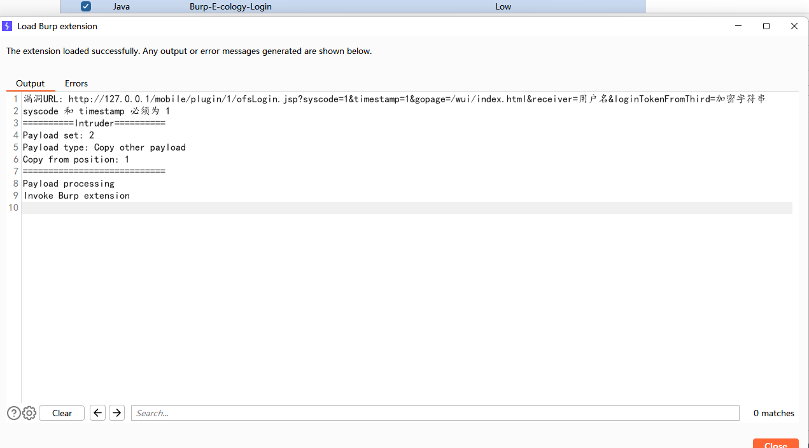
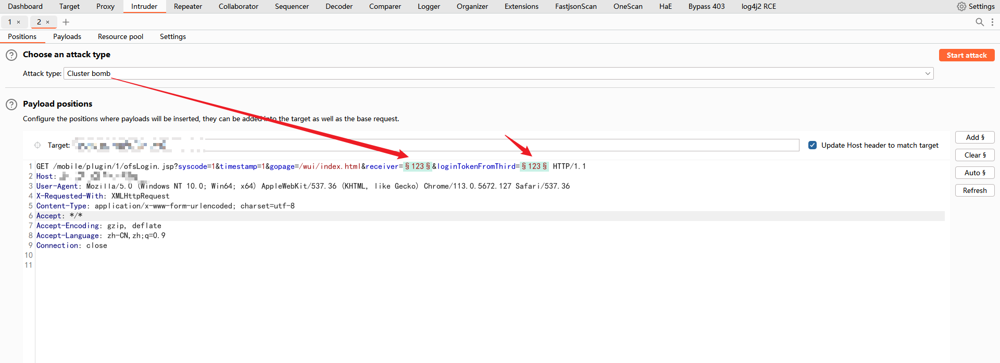
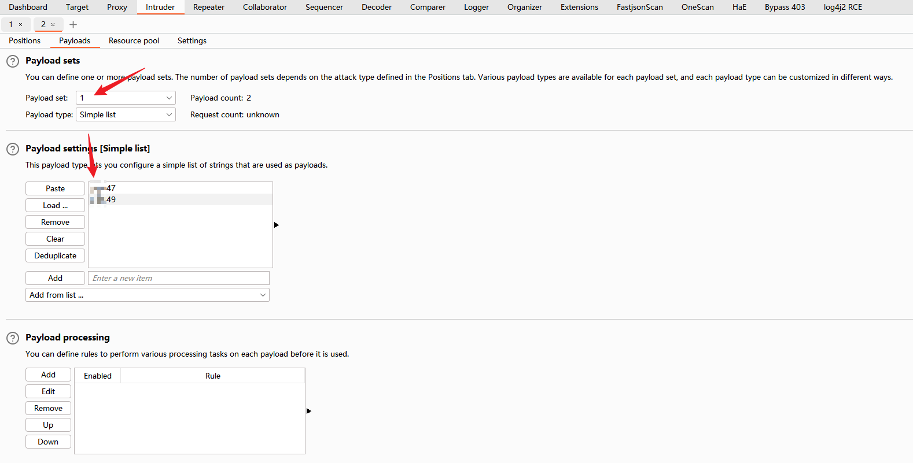
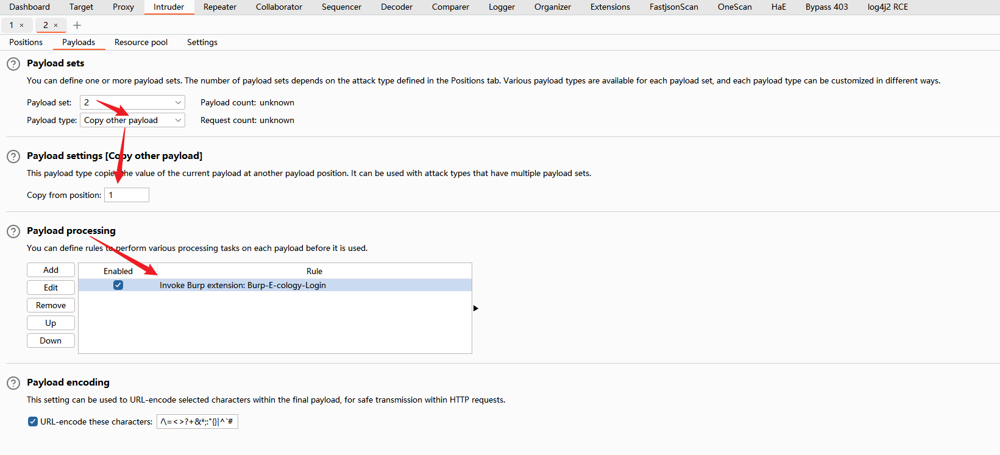
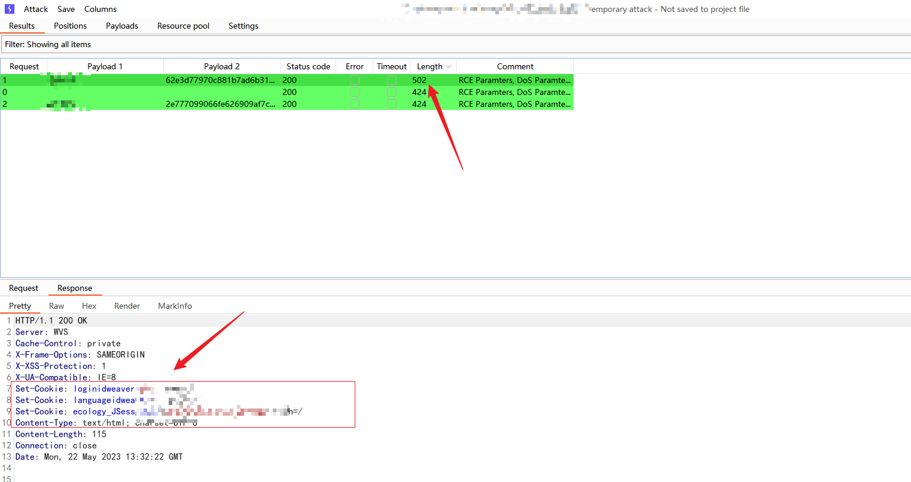

# burp-E-cology-login

### 使用方法


加载插件

```
漏洞URL: http://127.0.0.1/mobile/plugin/1/ofsLogin.jsp?syscode=1&timestamp=1&gopage=/wui/index.html&receiver=用户名&loginTokenFromThird=加密字符串


syscode 和 timestamp 必须为 1，因为代码写死了。
```




爆破模块：设置用户名和加密字符串





设置用户名字典





设置 copy other payload, 然后 Payload processing 设置插件进行加密





爆破成功，使用 Cookie 登录后台。





### 参考

https://github.com/bit4woo/burp-api-drops

https://mp.weixin.qq.com/s/mOrz36MJfu4CSyb8F_sBCQ


